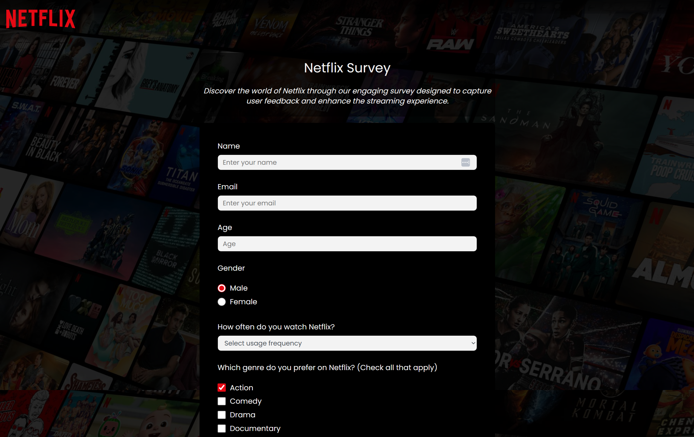
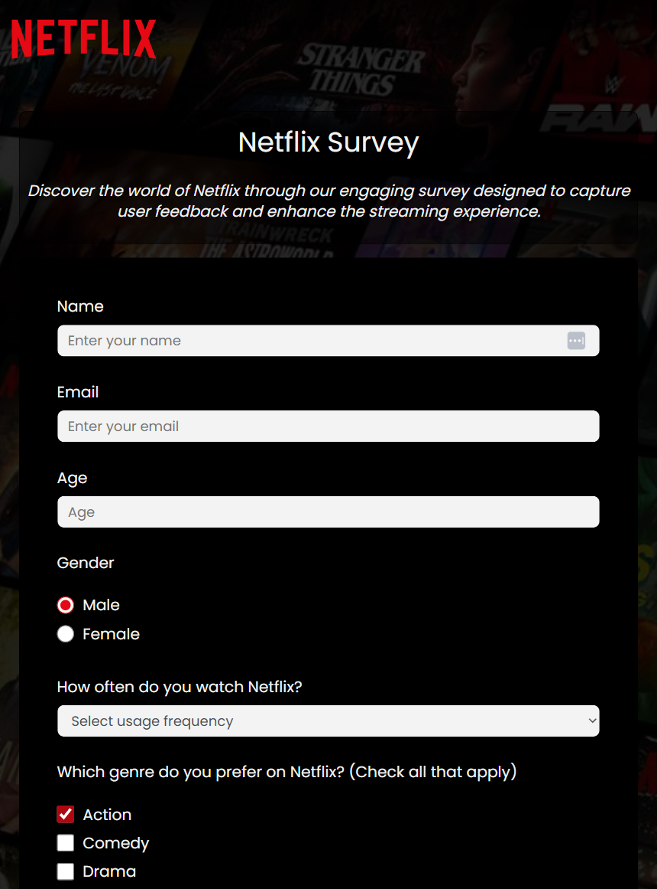
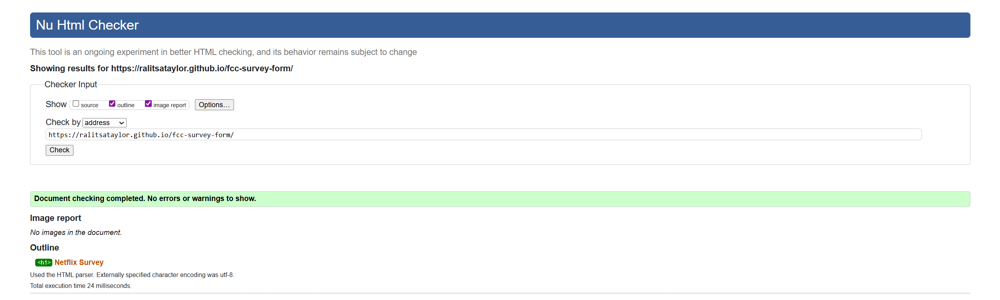
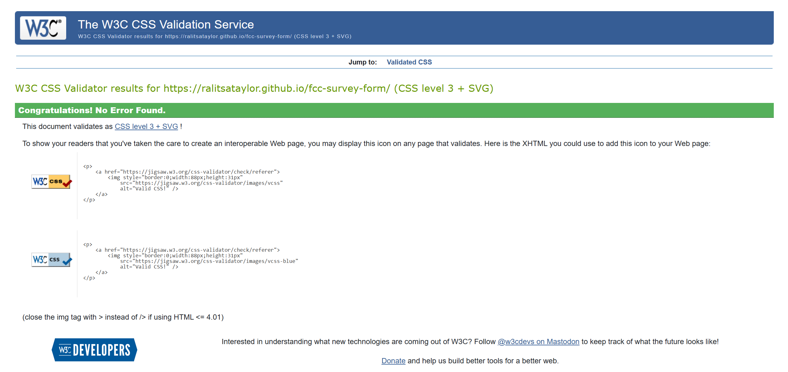
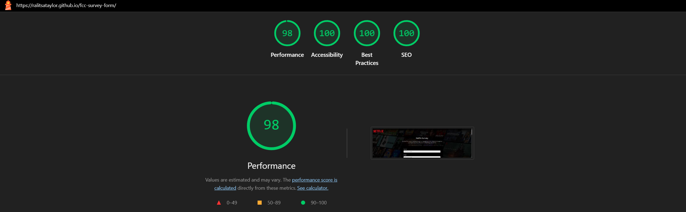
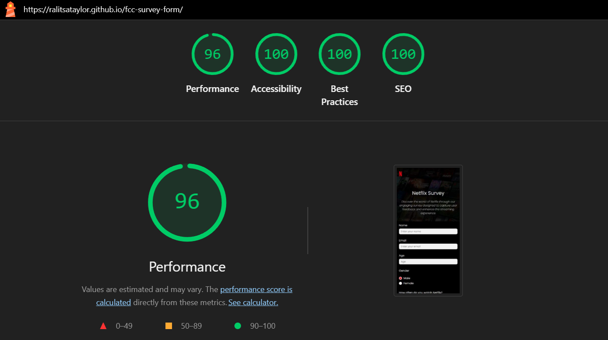
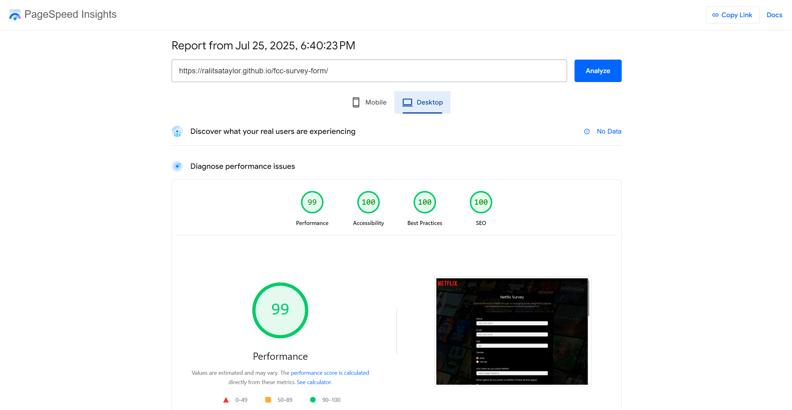
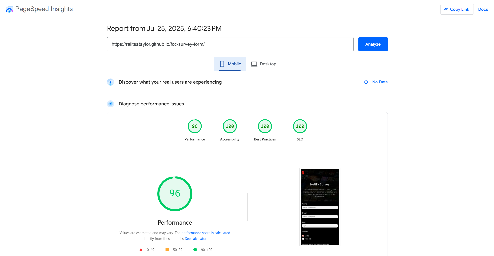

# 🚀 FCC: Build a Survey Form

📝 [CodePen](https://codepen.io/ralitsataylor/pen/ZgbxGq/)
🔗[Live GitHub Preview](https://ralitsataylor.github.io/fcc-survey-form/)

---

# 🌟 Inspiration & Credits

✨ I've got inspiration from the following resources:
- https://www.startquestion.com/survey-ideas/netflix-survey
- https://netflix.com
- 📝 https://codepen.io/Mohaimenul123478/pen/GRdGWww
- 📝 https://codepen.io/taniyajohnson/pen/YzRyZmx
- 📝 https://codepen.io/Pulkit-Goyal/pen/NWmMpxN

Made with 💗! 
Don't forget to give the project a star! ⭐

---

🎯 FreeCodeCamp Requirements

# 🏆 FreeCodeCamp:
## Responsive Web Design Projects - Build a Survey Form

Objective: Build an app that is functionally similar to https://codepen.io/freeCodeCamp/pen/VPaoNP. Do not copy this demo project.

Fulfill the below user stories and get all of the tests to pass. Give it your own personal style.

> You can use HTML, JavaScript, and CSS to complete this project. Plain CSS is recommended because that is what the lessons have covered so far and you should get some practice with plain CSS. You can use Bootstrap or SASS if you choose. Additional technologies (just for example jQuery, React, Angular, or Vue) are not recommended for this project, and using them is at your own risk. Other projects will give you a chance to work with different technology stacks like React. We will accept and try to fix all issue reports that use the suggested technology stack for this project. Happy coding!

* :id: User Story #1: You should have a page title in an h1 element with an id of title.
* :information_source: User Story #2: You should have a short explanation in a p element with an id of description.
* :id: User Story #3: You should have a form element with an id of survey-form.
* :index_pointing_at_the_viewer: User Story #4: Inside the form element, you are required to enter your name in an input field that has an id of name and a type of text.
* ✉️ User Story #5: Inside the form element, you are required to enter your email in an input field that has an id of email.
* ✅ User Story #6: If you enter an email that is not formatted correctly, you will see an HTML5 validation error.
* :1234: User Story #7: Inside the form, you can enter a number in an input field that has an id of number.
* ✅ User Story #8: The number input should not accept non-numbers, either by preventing you from typing them or by showing an HTML5 validation error (depending on your browser).
* :negative_squared_cross_mark: User Story #9: If you enter numbers outside the range of the number input, which are defined by the min and max attributes, you will see an HTML5 validation error.
* 📝 User Story #10: For the name, email, and number input fields, you can see corresponding label elements in the form, that describe the purpose of each field with the following ids: id="name-label", id="email-label", and id="number-label".
* :placard: User Story #11: For the name, email, and number input fields, you can see placeholder text that gives a description or instructions for each field.
* 📝 User Story #12: Inside the form element, you should have a select dropdown element with an id of dropdown and at least two options to choose from.
* :pencil2: User Story #13: Inside the form element, you can select an option from a group of at least two radio buttons that are grouped using the name attribute.
* :v: User Story #14: Inside the form element, you can select several fields from a series of checkboxes, each of which must have a value attribute.
* 💬 User Story #15: Inside the form element, you are presented with a textarea for additional comments.
* :arrow_forward: User Story #16: Inside the form element, you are presented with a button with id of submit to submit all the inputs.

You can build your project by forking this [CodePen pen](https://codepen.io/freeCodeCamp/pen/MJjpwO/).
Or you can use this CDN link to run the tests in any environment you like:
https://cdn.freecodecamp.org/testable-projects-fcc/v1/bundle.js.
Once you're done, submit the URL to your working project with all its tests passing.
Remember to use the [Read-Search-Ask](https://www.freecodecamp.org/forum/t/how-to-get-help-when-you-are-stuck/19514/) method if you get stuck.

---

# 🖥️ Desktop preview:

# 📱 Tablet preview:

# 📱 Mobile preview:

# ✨ Features:
- ✅ HTML5, CSS3, SCSS [Responsiveness, Transitions & Flex Layout], Vanilla JS
- ✅ [Google Fonts: Poppins](https://fonts.google.com/specimen/Poppins/)
- ✅ customized radio and checkboxes
- ✅ robots.txt
- ✅ sitemap.xml
- ✅ manifest.json
- ✅ service-worker.js

# 🛠️ Technologies used:
* [sass](https://www.npmjs.com/package/sass/) 🦄
* [gh-pages](https://www.npmjs.com/package/gh-pages/) 🚀

# 🧰 Online tools:
* [simple resizer](https://www.simpleimageresizer.com/resize/jpg/)
* [tinyjpg image compressor](tinyjpg.com/)

# 🌐 Browser Support:
(Last updated and tested: 25/07/2025)
* Chrome 138.0.7204.169 (64-bit) 🌟
* Firefox 141.0 (64-bit) 🦊
* Opera 120.0.5543.93 (64-bit) 🏴‍☠️
* Edge 138.0.3351.95 (64-bit) 🪟

# 🧪 Online Validators:
* [W3C HTML Validator](https://validator.w3.org/) ✔️
* [W3C CSS Validator](https://jigsaw.w3.org/css-validator/) ✔️
* [LightHouse Audit](https://developers.google.com/web/tools/lighthouse/) 💡
* [PageSpeed Insights Audit](https://pagespeed.web.dev/) ⚡

# 🏅 W3C HTML Validator

# 🏅 W3C CSS Validator

# 🌈 Chrome LightHouse Audit
* Desktop:

* Mobile:

# ⚡ PageSpeed Insights Results
* Desktop:

* Mobile:

---

Made with lots of 💖, ☕, and a sprinkle of ✨ by Ralitsa Taylor!
